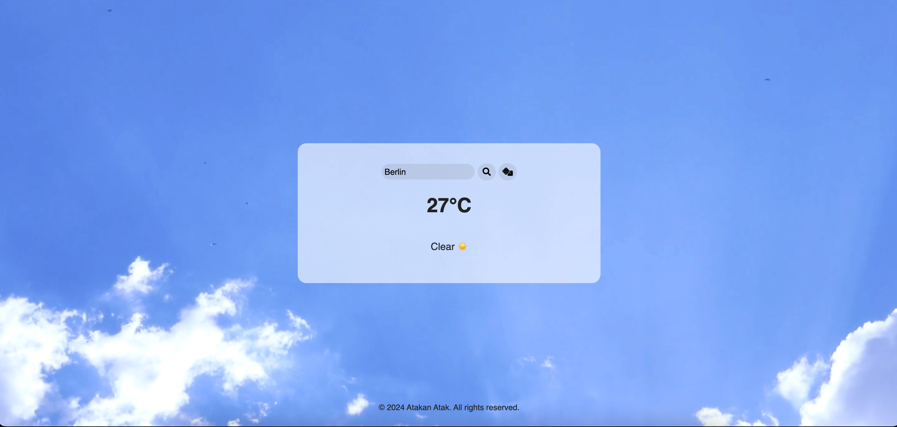
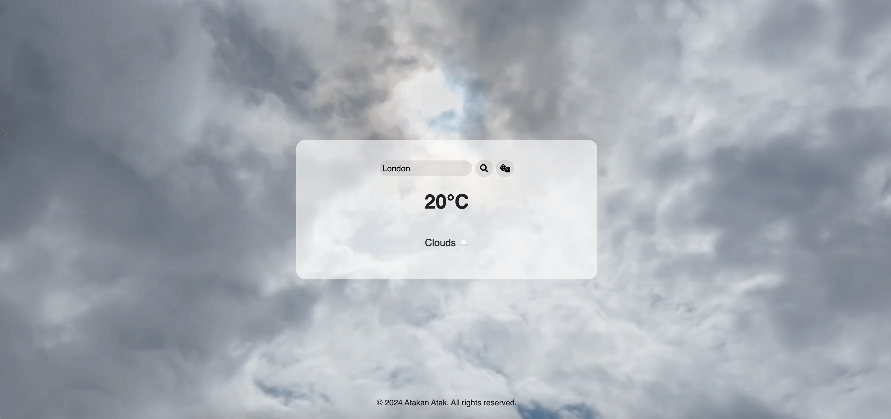

# Weather App

This Weather App is a simple web application that fetches weather data from the OpenWeatherMap API and displays it to the user. The app allows users to search for the weather in any city, and it also includes a button to generate a random city name. The background video changes based on the weather conditions, and the weather description includes an emoji.

## Features

- Search for the current weather in any city.
- Generate a random city name and fetch its weather.
- Display weather information including temperature and weather conditions.
- Change background video based on the weather conditions.
- Show weather conditions with relevant emojis.

## Live Demo

Check out the live demo of the app on [GitHub Pages](https://atakanatakk.github.io/weather-app/).

## Screenshot





## Installation

1. Clone the repository:
    ```bash
    git clone https://github.com/atakanatakk/weather-app.git
    ```

2. Navigate to the project directory:
    ```bash
    cd weather-app
    ```

3. Open `index.html` in your favorite web browser.

## Usage

1. Enter a city name in the input field and click the search button (🔍) to fetch and display the weather for that city.
2. Click the random city button (🎲) to generate a random city name and fetch its weather automatically.

## Project Structure

- `index.html`: The main HTML file that contains the structure of the web application.
- `script.js`: The JavaScript file that handles fetching data from the OpenWeatherMap API and updating the DOM.
- `styles.css`: The CSS file that styles the web application.

## Technologies Used

- HTML
- CSS
- JavaScript
- [OpenWeatherMap API](https://openweathermap.org/api)

## License

This project is licensed under the MIT License. See the [LICENSE](LICENSE) file for details.
